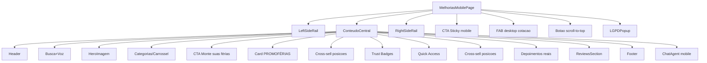

# Documentação Completa da Página `/melhorias-mobile`

**URL:** `http://localhost:3000/melhorias-mobile`

**Data de criação:** 2025-02-11

**Versão:** 1.0

---

## Sumário

1. [Visão Geral Técnica](#1-visão-geral-técnica)
2. [Mapa de Rotas e Navegação](#2-mapa-de-rotas-e-navegação)
3. [Arquitetura de Componentes](#3-arquitetura-de-componentes)
4. [Estados, Efeitos e Integrações de Dados](#4-estados-efeitos-e-integrações-de-dados)
5. [Dados de Side Rails e Cross-sell](#5-dados-de-side-rails-e-cross-sell)
6. [Detalhamento da UI por Seções](#6-detalhamento-da-ui-por-seções)
7. [Cross-sell Distribuído na Página](#7-cross-sell-distribuído-na-página)
8. [Detalhamento do Componente `MobileCrossSellCard`](#8-detalhamento-do-componente-mobilecrosssellcard)
9. [Comportamento LGPD e Privacidade](#9-comportamento-lgpd-e-privacidade)
10. [Experiência Mobile vs Desktop](#10-experiência-mobile-vs-desktop)
11. [Arquitetura de Integração com Backend](#11-arquitetura-de-integração-com-backend)
12. [Considerações de Acessibilidade e Performance](#12-considerações-de-acessibilidade-e-performance)

---

## 1. Visão Geral Técnica

### Stack Tecnológico

- **Framework:** Next.js 14+ (App Router)
- **Linguagem:** TypeScript
- **Biblioteca UI:** React 18
- **Estilização:** Tailwind CSS
- **Ícones:** `lucide-react`
- **Padrão de Renderização:** Client Component (`"use client"`)

### Arquivo Principal

- **Localização:** `apps/site-publico/app/melhorias-mobile/page.tsx`
- **Tipo:** Componente React funcional com hooks
- **Responsabilidade:** Página de teste/experimentação focada em melhorias de UX mobile

### Organização do Layout

A página utiliza um layout de **3 colunas** em desktop:

```
┌─────────────────────────────────────────────────────────┐
│                    Container Principal                    │
│  ┌──────────┐  ┌──────────────────┐  ┌──────────┐      │
│  │   Left   │  │   Conteúdo       │  │   Right  │      │
│  │  Side    │  │   Central        │  │  Side    │      │
│  │  Rail    │  │   (Melhorias)    │  │  Rail    │      │
│  │          │  │                  │  │          │      │
│  └──────────┘  └──────────────────┘  └──────────┘      │
└─────────────────────────────────────────────────────────┘
```

**Breakpoints Responsivos:**

- **Mobile:** `< 768px` - Apenas conteúdo central, side rails ocultos
- **Desktop:** `≥ 768px` - Layout de 3 colunas
  - Side rails: `18rem` (md), `20rem` (xl), `20.5rem` (2xl)
  - Conteúdo central: `minmax(0, 1fr)` (flexível)
  - Gaps: `4` (md), `6` (lg), `8` (xl), `10` (2xl)

---

## 2. Mapa de Rotas e Navegação

### Rota Principal

- **GET** `/melhorias-mobile` → Renderiza `MelhoriasMobilePage`

### Rotas Secundárias (Links e CTAs)

| Rota | Contexto de Uso | Componente/Local |
|------|----------------|------------------|
| `/` | Link "Voltar à home" | Banner de teste |
| `/buscar` | Campo de busca | Input touch-friendly |
| `/hoteis` | Categoria + Quick Access | Carrossel + Card Quick Access |
| `/ingressos` | Categoria | Carrossel |
| `/atracoes` | Categoria | Carrossel |
| `/promocoes` | Múltiplos pontos | Carrossel + Quick Access + PROMOFÉRIAS |
| `/cotacao` | CTA principal | Card "Monte suas férias" + Sticky CTA + FAB |
| `/login` | Autenticação | Botão "Entrar" no header |
| `/login?tab=register` | Registro | Botão "Cadastrar" no header |

### Relação com a Home (`/`)

A página `/melhorias-mobile` compartilha:

- **Mesma estrutura macro:** Side rails + conteúdo central
- **Componentes reutilizados:** `LeftSideRail`, `RightSideRail`, `MobileCrossSellCard`
- **Mesmas integrações:** APIs de header e side rails

**Diferenças principais:**

- Banner de aviso "Página de teste"
- Busca touch-friendly com suporte a voz
- Carrossel horizontal de categorias (mobile)
- Distribuição explícita de cross-sell cards
- CTA sticky mobile + FAB desktop

---

## 3. Arquitetura de Componentes

### Árvore de Componentes



### Componentes Principais

#### `LeftSideRail` (`components/home/left-side-rail.tsx`)

- **Props:** `section: SideRailSection`, `loading?: boolean`
- **Responsabilidade:** Renderizar coluna esquerda com cards "Descubra experiências"
- **Dados:** Consome `sideRailsData.left`
- **Visibilidade:** `hidden md:block` (apenas desktop)

#### `RightSideRail` (`components/home/right-side-rail.tsx`)

- **Props:** `section: SideRailSection`, `loading?: boolean`
- **Responsabilidade:** Renderizar coluna direita com cards "Oportunidades do dia"
- **Dados:** Consome `sideRailsData.right`
- **Visibilidade:** `hidden md:block` (apenas desktop)

#### `MobileCrossSellCard` (`components/home/mobile-cross-sell-card.tsx`)

- **Props:** `item`, `variant?`, `randomImage?`, `animation?`, `contextualSubtitle?`, `ctaText?`
- **Responsabilidade:** Card reutilizável de cross-sell com imagem, badge, título, subtítulo e CTA
- **Uso:** 4 posições na página (detalhadas na seção 7)

#### Componentes Auxiliares

- **`LGPDPopup`:** Modal de consentimento de privacidade
- **`ReviewsSection`:** Seção de avaliações dinâmicas
- **`ChatAgent`:** Widget de chat (mobile-only)
- **`ImageWithFallback`:** Wrapper de imagem com fallback
- **`Button`, `Input`, `Card`, `CardContent`, `Badge`:** Componentes de UI base

---

## 4. Estados, Efeitos e Integrações de Dados

### Estados (`useState`)

| Estado | Tipo | Inicialização | Uso |
|--------|------|---------------|-----|
| `error` | `string \| null` | `null` | Mensagem de erro genérica |
| `searchQuery` | `string` | `""` | Texto do campo de busca (read-only) |
| `showLGPDPopup` | `boolean` | `false` | Controle de exibição do popup LGPD |
| `sideRailsData` | `HomeSideRailsData` | `getHomeSideRailsFallback()` | Dados das side rails |
| `sideRailsLoading` | `boolean` | `true` | Estado de carregamento das side rails |
| `headerData` | `HeaderData \| null` | Objeto padrão com logo | Dados do hero (imagem/vídeo) |
| `voiceSupported` | `boolean` | `false` | Suporte a Web Speech API |
| `isListening` | `boolean` | `false` | Estado de escuta do microfone |

### Efeitos (`useEffect`)

#### 1. Detecção de Suporte a Voz

```typescript
useEffect(() => {
  setVoiceSupported(
    typeof window !== "undefined" &&
      !!(window.SpeechRecognition || window.webkitSpeechRecognition)
  )
}, [])
```

- **Quando executa:** Uma vez no mount (client-side)
- **Objetivo:** Detectar se o browser suporta Web Speech API
- **Resultado:** Atualiza `voiceSupported` para mostrar/ocultar botão de microfone

#### 2. Carregamento do Header (Hero)

```typescript
useEffect(() => {
  const loadData = async () => {
    try {
      setError(null)
      const API_BASE_URL = process.env.NEXT_PUBLIC_API_URL || window.location.origin
      try {
        const headerController = new AbortController()
        const headerTimeout = setTimeout(() => headerController.abort(), 5000)
        const headerResponse = await fetch(`${API_BASE_URL}/api/website/header`, {
          signal: headerController.signal
        })
        clearTimeout(headerTimeout)
        if (headerResponse.ok) {
          const result = await headerResponse.json()
          if (result?.success && result?.data) {
            setHeaderData({
              type: result.data.type || "image",
              url: result.data.url || result.data.logo,
              title: result.data.title,
              autoplay: result.data.autoplay || false,
              muted: result.data.muted ?? true,
            })
          }
        }
      } catch {
        setHeaderData(fallbackHeader)
      }
    } catch {
      setError("Erro ao carregar dados. Exibindo versão padrão.")
    }
  }
  loadData()
  if (!localStorage.getItem("reservei-lgpd-consent")) {
    setShowLGPDPopup(true)
  }
}, [])
```

- **Quando executa:** Uma vez no mount
- **Objetivo:** Carregar header dinâmico da API
- **Timeout:** 5 segundos (via `AbortController`)
- **Fallback:** Header padrão (logo + título) em caso de erro
- **LGPD:** Verifica consentimento no `localStorage`

#### 3. Carregamento dos Side Rails

```typescript
useEffect(() => {
  let mounted = true
  const loadSideRails = async () => {
    try {
      const data = await getHomeSideRailsData()
      if (mounted) setSideRailsData(data)
    } catch {
      if (mounted) setSideRailsData(getHomeSideRailsFallback())
    } finally {
      if (mounted) setSideRailsLoading(false)
    }
  }
  loadSideRails()
  return () => { mounted = false }
}, [])
```

- **Quando executa:** Uma vez no mount
- **Objetivo:** Carregar dados das side rails via API
- **Fallback:** Dados estáticos em caso de erro
- **Cleanup:** Previne setState em componente desmontado

### Callback (`useCallback`): Busca por Voz

```typescript
const startVoiceSearch = useCallback(() => {
  if (typeof window === "undefined") return
  type RecognitionInstance = {
    lang: string
    continuous: boolean
    interimResults: boolean
    start: () => void
    onresult: (ev: VoiceResultEvent) => void
    onend: () => void
    onerror: () => void
  }
  const Win = window as Window & {
    SpeechRecognition?: new () => RecognitionInstance
    webkitSpeechRecognition?: new () => RecognitionInstance
  }
  const SR = Win.SpeechRecognition ?? Win.webkitSpeechRecognition
  if (!SR) return
  const recognition = new SR()
  recognition.lang = "pt-BR"
  recognition.continuous = false
  recognition.interimResults = false
  setIsListening(true)
  recognition.onresult = (event: VoiceResultEvent) => {
    const last = event.results[event.results.length - 1]
    const transcript = (last && last[0] ? last[0].transcript : "") as string
    const q = encodeURIComponent(transcript.trim())
    window.location.href = `/buscar?q=${q}`
  }
  recognition.onend = () => setIsListening(false)
  recognition.onerror = () => setIsListening(false)
  recognition.start()
}, [])
```

**Fluxo de Execução:**

1. Verifica suporte a Web Speech API
2. Instancia `SpeechRecognition` (ou `webkitSpeechRecognition`)
3. Configura idioma `pt-BR` e modo "frase única"
4. Ao reconhecer:
   - Extrai último resultado do evento
   - Normaliza texto (`trim`, `encodeURIComponent`)
   - Redireciona para `/buscar?q=<transcript>`
5. Atualiza `isListening` ao finalizar ou em erro

---

## 5. Dados de Side Rails e Cross-sell

### Modelos de Dados (`lib/home-side-rails.ts`)

#### `SideRailItem`

```typescript
export interface SideRailItem {
  id: string;              // Identificador único (ex: "hotels", "water-parks")
  title: string;          // Título do card
  subtitle: string;       // Descrição/legenda
  href: string;           // URL de destino
  badge?: string;         // Badge opcional (ex: "Hotelaria", "Parques")
  image?: string;         // URL da imagem
  imageAlt?: string;      // Texto alternativo da imagem
  highlight?: boolean;    // Se true, badge anima com pulse
  expiresAt?: string;     // Data de expiração (opcional)
}
```

#### `SideRailSection`

```typescript
export interface SideRailSection {
  title: string;          // Título da seção (ex: "Descubra experiências")
  description: string;    // Descrição da seção
  items: SideRailItem[];  // Array de itens
}
```

#### `HomeSideRailsData`

```typescript
export interface HomeSideRailsData {
  left: SideRailSection;   // Seção esquerda
  right: SideRailSection;  // Seção direita
}
```

### Fallback Estático

**Seção Esquerda ("Descubra experiências"):**

- `season-rentals` - Aluguel por temporada → `/marketplace`
- `hotels` - Reservas de hotéis → `/hoteis`
- `water-parks` - Parques aquáticos → `/ingressos`
- `attractions` - Atrações e passeios → `/atracoes`
- `auctions` - Leilões de viagem → `/leiloes`

**Seção Direita ("Oportunidades do dia"):**

- `flash-deals` - Flash Deals → `/flash-deals`
- `group-travel` - Viagens em grupo → `/viagens-grupo`
- `excursions` - Excursões → `/group-travel`
- `weekly-offer` - Oferta da semana → `/promocoes` (highlight: true)

### Função `getHomeSideRailsData()`

**Fluxo de Execução:**

1. **Tenta buscar da API:**
   - Endpoint: `/api/website/side-rails`
   - Base URL: `process.env.NEXT_PUBLIC_API_URL` ou `window.location.origin`

2. **Enriquecimento com Fallback:**
   - Função `enrichWithFallbackImages()` garante que itens tenham `image`, `imageAlt` e `highlight` mesmo se a API não retornar

3. **Busca de Contagens (paralelo):**
   - `/api/website/content/hotels?limit=1&status=active`
   - `/api/website/content/tickets?limit=1&status=active`
   - `/api/website/content/attractions?limit=1&status=active`
   - `/api/website/content/promotions?limit=1&status=active`

4. **Atualização de Subtítulos:**
   - Se contagem disponível, atualiza subtítulos:
     - `hotels` → "X opcoes ativas"
     - `water-parks` → "X opcoes ativas"
     - `attractions` → "X opcoes ativas"
     - `flash-deals` → "X opcoes ativas"

5. **Fallback em Erro:**
   - Retorna `getHomeSideRailsFallback()` (clone do fallback estático)

### Uso de `getCrossSellItems` na Página

A função `getCrossSellItems(context, data, options)` (de `lib/cross-sell-matrix.ts`) seleciona itens de cross-sell baseado em:

- **Contexto:** `"home"` (para esta página)
- **Dados:** `sideRailsData` (carregado da API ou fallback)
- **Opções:**
  - `limit`: número máximo de itens
  - `excludeIds`: IDs a excluir (evita repetição)

**Posições de Uso:**

1. **Após categorias:** `{ limit: 1 }` → 1 card (oferta/flash)
2. **Após PROMOFÉRIAS:** `{ limit: 4 }` + filtro `["hotels", "water-parks"]` → 2 cards
3. **Entre Trust Badges e Quick Access:** `{ excludeIds: ["hotels", "water-parks"], limit: 1 }` → 1 card
4. **Após Quick Access:** `{ limit: 6 }` + filtro `["attractions", "season-rentals"]` → 2 cards

---

## 6. Detalhamento da UI por Seções

### 6.1. Header

**Estrutura:**

- Logo (`Image` com `width={40} height={40}`, `rounded-full`, `bg-white/20 p-1`)
- Título "Reservei Viagens" (`text-2xl font-bold`)
- Botões de ação:
  - **"Entrar"** (`variant="ghost"`, borda branca, hover com fundo translúcido)
  - **"Cadastrar"** (fundo branco, texto azul, hover azul-claro)

**UX:** Identidade visual forte, acesso rápido a autenticação

### 6.2. Busca Touch-friendly + Voz

**Input:**

- Largura total (`flex-1`)
- Altura mínima `min-h-12` (48px - confortável para toque)
- `readOnly` com `onClick` redirecionando para `/buscar`
- Ícone `Search` posicionado com `absolute left-3`

**Botão de Voz (condicional):**

- Renderizado apenas se `voiceSupported === true`
- Botão quadrado (`w-12 h-12`) com ícone `Mic`
- `isListening` controla animação `animate-pulse`
- `disabled={isListening}` previne múltiplas ativações

**Mensagem Auxiliar:**

- Texto pequeno: "Toque no microfone para buscar por voz"
- Visível apenas se `voiceSupported === true`

**UX:** Campo de busca com área de toque ampla, entrada por voz facilita uso em mobile

### 6.3. Hero (Imagem/Vídeo Estático)

**Área:**

- `relative w-full aspect-video`
- Gradiente de fundo (`from-blue-500 to-blue-700`)
- `rounded-2xl`, `shadow-xl`

**Conteúdo:**

- `ImageWithFallback` usa `headerData.url` e `headerData.title`
- Se `headerData` ainda não carregado, mostra placeholder "Carregando..."

**UX:** Primeiro impacto visual, fallback garante quebra visual mínima em caso de erro

### 6.4. Carrossel Mobile de Categorias

**Mobile (`md:hidden`):**

- `overflow-x-auto`, `snap-x snap-mandatory`, `flex gap-4`
- Cada item:
  - Botão com ícone (emoji), label e `min-h-[100px]`
  - Links para `/buscar`, `/hoteis`, `/ingressos`, `/atracoes`, `/promocoes`
  - Botão especial "Ver Promoções" com gradiente amarelo/laranja

**Desktop (`hidden md:grid`):**

- Grid 4 colunas (`grid-cols-4`)
- Categorias em grid + botão "Ver Promoções Especiais" full width

**UX:** Mobile usa gesto de scroll horizontal, desktop usa grid tradicional

### 6.5. CTA "Monte suas férias"

**Card:**

- Gradiente `from-blue-600 to-blue-800`
- Overlay `bg-gradient-to-r from-transparent to-white/10`
- Texto principal: "Escolha hotel, parque, atrações e extras em um só lugar"
- Descrição: "Datas → Hotel → Parques → Atrações → Café da manhã, roupa de cama e mais"
- CTA em formato "pill" com ícone `Calendar` e texto "Montar meu roteiro"

**Link:** `Link href="/cotacao"` envolvendo card inteiro

**UX:** Direciona para fluxo de orçamento completo, incentiva combinação de produtos

### 6.6. Bloco PROMOFÉRIAS

**Card:**

- Gradiente `from-yellow-400 to-orange-400`
- Overlay `bg-gradient-to-r from-transparent to-white/20`
- `Badge` vermelho com `animate-pulse`: "🔥 PROMOFÉRIAS CALDAS NOVAS!"
- Título: "Hotel + Parque Aquático"
- Preço grande (`text-4xl font-black`): "R$ 149,99"
- Copy de urgência: "Sinta a magia de Caldas Novas!"
- Botão principal: "Quero Esta Super Oferta!" → `/promocoes`

**UX:** Destaque emocional e racional (economia), foca em oferta combinada

### 6.7. Trust Badges

**Grid de 3 Cards:**

- Ícones grandes (`w-8 h-8`): `CheckCircle`, `Shield`, `Award`
- Títulos: "Garantia de Melhor Preço", "Pagamento 100% Seguro", "+5000 Clientes Satisfeitos"
- Layout centralizado com ícone acima do texto

**UX:** Aumenta confiança (prova social, segurança, melhor preço)

### 6.8. Quick Access

**Grid de 2 Cards:**

- **Hotéis:** Ícone 🏨, descrição "Conforto e qualidade garantidos", botão "Ver Hotéis"
- **Promoções:** Ícone 🏷️, descrição "Ofertas imperdíveis", botão "Ver Ofertas"

**UX:** Atalhos para seções principais de navegação

### 6.9. Seções Sociais

**Depoimentos Reais:**

- Array `DEPOIMENTOS_REAIS` com 3 depoimentos estáticos
- Cada card mostra:
  - Texto em itálico
  - Autor (`font-semibold`)
  - Fonte (`text-xs text-gray-500`)

**ReviewsSection:**

- Componente separado que assume exibição de avaliações dinâmicas/externas

**UX:** Prova social através de depoimentos reais e avaliações agregadas

### 6.10. Footer

**Conteúdo:**

- Logo pequeno (`Image` com `loading="lazy"`)
- Nome "Reservei Viagens"
- Tagline: "Parques, Hotéis & Atrações"
- Endereços:
  - Sede Caldas Novas: "Rua RP5, Residencial Primavera 2 - Caldas Novas, Goiás"
  - Filial Cuiabá: "Av. Manoel José de Arruda, Porto - Cuiabá, Mato Grosso"
- Direitos autorais: "© 2024-2025 Reservei Viagens. Todos os direitos reservados."

**UX:** Reforça marca e localiza empresa institucionalmente

### 6.11. Elementos Fixos e Auxiliares

**Banner de Teste (mobile-only):**

- `md:hidden` com mensagem "📱 Página de teste – Melhorias mobile"
- Link para voltar à home (`/`)

**ChatAgent:**

- Renderizado apenas em mobile (`md:hidden`)
- Widget de chat flutuante

**Sticky CTA Mobile:**

- Barra fixa na parte inferior (`fixed bottom-20`)
- Link para `/cotacao` com ícone `Phone` e texto "Reservar Agora"
- `z-50` para ficar acima de outros elementos

**FAB Desktop:**

- `hidden md:flex` - Botão flutuante no canto inferior direito
- Link para `/cotacao` com ícone `Phone` e texto "Realizar Cotação"
- `rounded-full`, `shadow-lg`, `z-50`

**Botão Scroll-to-top:**

- Botão circular (`w-12 h-12`) no canto inferior direito
- Símbolo "↑"
- `onClick` com `window.scrollTo({ top: 0, behavior: "smooth" })`

---

## 7. Cross-sell Distribuído na Página

### Posições e Lógica

#### Posição 1: Após Categorias

```tsx
<div>
  {getCrossSellItems("home", sideRailsData, { limit: 1 }).map((item) => (
    <MobileCrossSellCard 
      key={item.id} 
      item={item} 
      variant="full" 
      animation="slide" 
    />
  ))}
</div>
```

- **Quantidade:** 1 card
- **Tipo:** Normalmente `weekly-offer` ou `flash-deals`
- **Animação:** `slide` (slide-in from bottom)

#### Posição 2: Após PROMOFÉRIAS

```tsx
<div className="grid grid-cols-1 md:grid-cols-2 gap-3">
  {getCrossSellItems("home", sideRailsData, { limit: 4 })
    .filter((i) => ["hotels", "water-parks"].includes(i.id))
    .slice(0, 2)
    .map((item) => (
      <MobileCrossSellCard key={item.id} item={item} variant="full" />
    ))}
</div>
```

- **Quantidade:** 2 cards
- **Tipos:** `hotels` e `water-parks`
- **Layout:** Grid responsivo (1 coluna mobile, 2 colunas desktop)

#### Posição 3: Entre Trust Badges e Quick Access

```tsx
<div>
  {getCrossSellItems("home", sideRailsData, { 
    excludeIds: ["hotels", "water-parks"], 
    limit: 1 
  }).map((item) => (
    <MobileCrossSellCard 
      key={item.id} 
      item={item} 
      variant="full" 
      animation="fade" 
    />
  ))}
</div>
```

- **Quantidade:** 1 card
- **Exclusões:** Evita repetir `hotels` e `water-parks`
- **Animação:** `fade`

#### Posição 4: Após Quick Access

```tsx
<div className="grid grid-cols-1 md:grid-cols-2 gap-3">
  {getCrossSellItems("home", sideRailsData, { limit: 6 })
    .filter((i) => ["attractions", "season-rentals"].includes(i.id))
    .slice(0, 2)
    .map((item) => (
      <MobileCrossSellCard key={item.id} item={item} variant="full" />
    ))}
</div>
```

- **Quantidade:** 2 cards
- **Tipos:** `attractions` e `season-rentals`
- **Layout:** Grid responsivo

### Estratégia de Marketing

- **Distribuição inteligente:** Cards inseridos entre seções de alto interesse
- **Evita "banner blindness":** Não concentra tudo no topo
- **Consistência visual:** Todos os cards seguem mesmo padrão de design
- **Rotas estratégicas:** Direcionam para páginas de alta conversão

---

## 8. Detalhamento do Componente `MobileCrossSellCard`

### Interface de Props

```typescript
export interface MobileCrossSellCardProps {
  item: SideRailItem                    // Item obrigatório
  variant?: "compact" | "full"          // Altura da imagem (padrão: "full")
  randomImage?: boolean                 // Usa imagem aleatória do pool (padrão: false)
  animation?: "fade" | "slide" | "scale" | "none"  // Tipo de animação (padrão: "fade")
  contextualSubtitle?: string           // Sobrescreve item.subtitle
  ctaText?: "Ver oferta" | "Abrir agora" | "Completar pacote"  // Texto do CTA (padrão: "Ver oferta")
}
```

### Estrutura de Layout

```
┌─────────────────────────┐
│   Imagem (hero)        │ ← height: 100px (compact) ou 120px (full)
│   [Overlay gradiente]  │
│   [Badge] (opcional)   │ ← top-right, anima se highlight
├─────────────────────────┤
│   Título               │ ← font-semibold text-sm
│   Subtítulo            │ ← text-xs, line-clamp-2
│   CTA textual          │ ← text-xs font-medium text-blue-600
└─────────────────────────┘
```

### Lógica de Imagem

```typescript
const imageUrl = useMemo(() => {
  if (randomImage) return getRandomImage(item.id)
  return item.image ?? DEFAULT_IMAGE
}, [item.id, item.image, randomImage])
```

- **Se `randomImage === true`:** Usa `getRandomImage(item.id)` do pool de imagens
- **Caso contrário:** Usa `item.image` ou fallback `DEFAULT_IMAGE`

### Classes Tailwind Principais

**Wrapper Link:**
- `block` - Display block
- `focus-visible:outline-none focus-visible:ring-2 focus-visible:ring-blue-500` - Acessibilidade
- `rounded-xl` - Bordas arredondadas
- `min-h-[44px]` - Altura mínima para toque

**Card:**
- `overflow-hidden border border-gray-200/90 bg-white rounded-xl`
- `transition-all duration-200 hover:shadow-lg active:scale-[0.98]` - Interações

**Imagem:**
- `fill` - Preenche container
- `object-cover` - Mantém proporção
- `sizes="(max-width: 768px) 100vw, (max-width: 1200px) 50vw, 320px"` - Responsividade

**Overlay:**
- `bg-gradient-to-t from-black/60 via-black/20 to-transparent` - Gradiente escuro no topo

**Badge:**
- `absolute top-2 right-2 text-[10px] opacity-95`
- `animate-pulse` se `item.highlight === true`

**Conteúdo Textual:**
- Título: `font-semibold text-sm text-gray-900 leading-snug`
- Subtítulo: `text-xs text-gray-600 line-clamp-2`
- CTA: `text-xs font-medium text-blue-600`

---

## 9. Comportamento LGPD e Privacidade

### `LGPDPopup`

**Condição de Exibição:**

```typescript
if (!localStorage.getItem("reservei-lgpd-consent")) {
  setShowLGPDPopup(true)
}
```

- Verifica `localStorage` no mount
- Se não houver consentimento salvo, abre popup

**Renderização:**

```tsx
{showLGPDPopup && (
  <LGPDPopup 
    onAccept={() => {}} 
    onDecline={() => {}} 
  />
)}
```

- Callbacks vazios na página de melhorias (comportamento pode ser definido no componente)

**UX:** Conformidade com LGPD, pede consentimento antes de tracking/analytics

---

## 10. Experiência Mobile vs Desktop

### Diferenças Principais

| Aspecto | Mobile | Desktop |
|---------|--------|---------|
| **Side Rails** | Ocultos (`hidden md:block`) | Visíveis nas laterais |
| **Banner de Teste** | Visível | Oculto |
| **Categorias** | Carrossel horizontal (`overflow-x-auto`) | Grid 4 colunas |
| **Chat** | Widget flutuante (`ChatAgent`) | Oculto |
| **CTA Principal** | Barra sticky inferior | FAB no canto direito |
| **Busca** | Campo grande + botão voz | Campo padrão (sem voz?) |

### Decisões de UX

- **Mobile-first:** Prioriza experiência touch-friendly
- **Gestos nativos:** Carrossel horizontal usa gesto de swipe
- **Acessibilidade:** Botões grandes (`min-h-12`), áreas de toque amplas
- **Conversão:** CTA sticky sempre visível em mobile
- **Desktop:** Aproveita espaço lateral para side rails, FAB discreto

---

## 11. Arquitetura de Integração com Backend

### Endpoints Utilizados

#### `/api/website/header`

- **Método:** GET
- **Timeout:** 5 segundos (via `AbortController`)
- **Resposta Esperada:**
  ```json
  {
    "success": true,
    "data": {
      "type": "image" | "video",
      "url": "https://...",
      "title": "Reservei Viagens - Hotéis em Caldas Novas",
      "autoplay": false,
      "muted": true
    }
  }
  ```
- **Fallback:** Header padrão (logo + título)

#### `/api/website/side-rails`

- **Método:** GET
- **Resposta Esperada:**
  ```json
  {
    "success": true,
    "data": {
      "left": { "title": "...", "description": "...", "items": [...] },
      "right": { "title": "...", "description": "...", "items": [...] }
    }
  }
  ```
- **Enriquecimento:** `enrichWithFallbackImages()` garante imagens/highlight
- **Fallback:** Dados estáticos de `fallbackData`

#### `/api/website/content/*` (Indiretos)

- **Endpoints:**
  - `/api/website/content/hotels?limit=1&status=active`
  - `/api/website/content/tickets?limit=1&status=active`
  - `/api/website/content/attractions?limit=1&status=active`
  - `/api/website/content/promotions?limit=1&status=active`
- **Uso:** Obter contagens para atualizar subtítulos dos side rails
- **Execução:** Paralela via `Promise.all()`

### Estratégias de Fallback

1. **Header:** Fallback para logo padrão em caso de erro/timeout
2. **Side Rails:** Fallback estático completo em caso de erro
3. **Contagens:** Se falhar, mantém subtítulos originais dos itens
4. **Mensagens de Erro:** Banner amarelo informa usuário sem bloquear página

---

## 12. Considerações de Acessibilidade e Performance

### Acessibilidade

- **Imagens:** Todas têm `alt` descritivo (`item.imageAlt ?? item.title`)
- **Foco:** Cards clicáveis têm `focus-visible:ring-2` para navegação por teclado
- **Áreas de Toque:** Mínimo `44px` (`min-h-[44px]`, `min-h-12`)
- **Semântica:** Uso de `Link`, `button`, `header`, `footer` apropriados
- **ARIA:** Botão de voz tem `aria-label="Buscar por voz"`

### Performance

- **Lazy Loading:** Imagens do footer usam `loading="lazy"`
- **Priority Loading:** Logo e hero usam `priority` para LCP
- **Animações Leves:** Classes Tailwind (`animate-in`, `animate-pulse`) são CSS puro
- **Memoização:** `useMemo` para cálculo de URL de imagem no `MobileCrossSellCard`
- **Cleanup:** `useEffect` com cleanup previne memory leaks
- **Fallbacks Rápidos:** Dados estáticos garantem renderização imediata

### Otimizações Futuras

- **Code Splitting:** Componentes pesados podem ser lazy-loaded
- **Image Optimization:** Next.js Image já otimiza, mas pode ajustar `sizes` conforme necessário
- **API Caching:** Considerar cache de side rails (atualmente `cache: "no-store"`)

---

## Conclusão

A página `/melhorias-mobile` é uma **variação de teste/experimentação** da home principal que concentra:

- ✅ **Melhorias de UX mobile** (busca com voz, carrossel, CTA sticky)
- ✅ **Distribuição inteligente de cross-sell** baseada em dados dinâmicos
- ✅ **Integrações resilientes** com backend (fallbacks em todos os pontos)
- ✅ **Arquitetura de componentes clara** e reutilizável

Esta documentação serve como referência completa para desenvolvedores que precisam entender, manter ou estender a página.

---

**Última atualização:** 2025-02-11  
**Autor:** Documentação gerada automaticamente  
**Versão do código:** Baseado em `apps/site-publico/app/melhorias-mobile/page.tsx`
