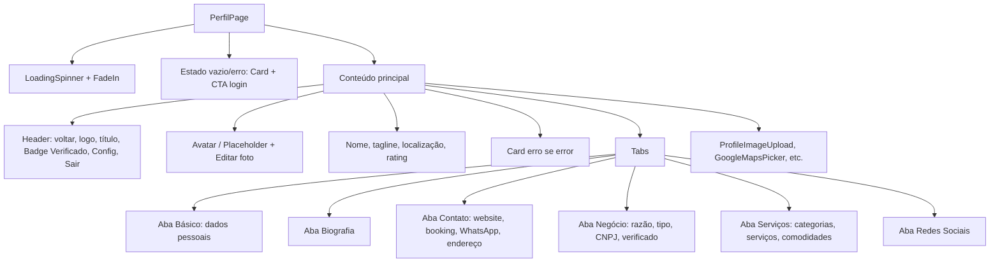

# Documentação das Páginas Contato, Institucionais e Perfil

**Data de criação:** 2025-02-11  
**Versão:** 1.0

---

## Sumário

1. [Visão Geral e Rotas](#1-visão-geral-e-rotas)
2. [Página Contato (`/contato`)](#2-página-contato-contato)
3. [Páginas Institucionais](#3-páginas-institucionais)
4. [Página Perfil (`/perfil`)](#4-página-perfil-perfil)
5. [Integrações com Backend](#5-integrações-com-backend)
6. [Acessibilidade e Performance](#6-acessibilidade-e-performance)

---

## 1. Visão Geral e Rotas

### Stack comum

- **Framework:** Next.js 14+ (App Router)
- **Linguagem:** TypeScript
- **UI:** React 18, Tailwind CSS, componentes em `@/components/ui` e `@/components/*`
- **Ícones:** `lucide-react`
- **Navegação:** `next/link`, `useRouter` onde necessário

### Mapa de rotas

| Rota | Arquivo | Tipo | Descrição |
|------|---------|------|-----------|
| `/contato` | `app/contato/page.tsx` | Client | Canais de atendimento, WhatsApp, unidades, redes |
| `/termos` | `app/termos/page.tsx` | Server | Termos de uso (conteúdo em elaboração) |
| `/privacidade` | `app/privacidade/page.tsx` | Server | Redirect → `/politica-privacidade` |
| `/politica-privacidade` | `app/politica-privacidade/page.tsx` | Client | Política de privacidade e LGPD |
| `/quality` | `app/quality/page.tsx` | Client | Entrada para Dashboard e Leaderboard de qualidade |
| `/perfil` | `app/perfil/page.tsx` | Client | Perfil do usuário (área logada) |

### Navegação de entrada/saída

- **Contato:** entrada por link no footer, termos, etc.; saída para `/`, WhatsApp externo, redes sociais.
- **Institucionais:** entrada por footer (Termos, Privacidade), links internos; saída para `/`, `/contato`.
- **Perfil:** entrada por menu “Perfil” (ex.: home); redirecionamento para `/login?redirect=/perfil` se não autenticado; saída para `/`, `/login`, logout.

---

## 2. Página Contato (`/contato`)

### 2.1. Visão técnica

- **Arquivo:** `app/contato/page.tsx`
- **Tipo:** Client Component (`"use client"`)
- **Layout:** Uma coluna, `max-w-md mx-auto`, fundo em gradiente (roxo→azul). Sem layout compartilhado específico além do root.

### 2.2. Arquitetura de componentes

```
ContatoPage
├── [Loading] Tela cheia (gradiente + texto + barra)
└── [Conteúdo]
    ├── Header (logo, voltar, título "Reservei Viagens", subtítulo)
    ├── Main
    │   ├── Card Consultoria de Viagens (CTA WhatsApp)
    │   ├── Card Catálogos de Pacotes (CTA WhatsApp)
    │   ├── Card Contato e WhatsApp (grid de números)
    │   ├── Card Agendamentos e Reservas (CTA WhatsApp)
    │   ├── Card Nossas Unidades (MapPin, Mail, Phone, Clock)
    │   ├── Card Siga-nos nas Redes (Facebook, Instagram, Site)
    │   └── Link "Voltar ao Início"
    └── Float WhatsApp (fixo)
```

**Componentes usados:** `Button`, `Card`, `CardContent`, `Image` (Next), `Link`. Sem componentes de página compartilhados além dos UI base.

### 2.3. Estados e efeitos

| Estado | Tipo | Inicial | Uso |
|--------|------|--------|-----|
| `isLoading` | `boolean` | `true` | Simula carregamento; `setTimeout(..., 1500)` no `useEffect` define `false`. |

Não há chamadas a API; dados (telefones, links, endereços) estão fixos no JSX.

### 2.4. UI por seção

- **Loading:** Tela cheia com gradiente roxo→azul, ícone 📞, texto “Carregando Contatos” e barra de progresso animada.
- **Header:** Gradiente roxo, botão voltar (ghost branco), logo, título em badge roxo, subtítulo “Especialistas em Caldas Novas”.
- **Cards de ação:** Cada um com gradiente próprio (azul/ciano, laranja/vermelho, verde/esmeralda, cinza), título, descrição e botão(es) que abrem WhatsApp com mensagem pré-definida ou número.
- **Nossas Unidades:** Card branco semitransparente com endereços (Caldas Novas e Cuiabá), e-mail, telefone e horário; ícones e links em azul.
- **Redes:** Botões circulares (Facebook azul, Instagram rosa, Site cinza) com `onClick` para `window.open`.
- **Voltar ao Início:** Link para `/` com `Button` outline.
- **Float:** Link fixo inferior direito para WhatsApp (ícone Phone), verde, com animação de pulso e hover em escala.

### 2.5. Dados fixos (hardcoded)

- Números WhatsApp: 5564993197555, 5564993068752, 5565992351207, 5565992048814.
- E-mail: reservas@reserveiviagens.com.br.
- Telefone: (65) 2127-0415.
- Endereços: Sede Caldas Novas (Rua RP5, Residencial Primavera 2); Filial Cuiabá (Av. Manoel José de Arruda, Porto).
- Redes: Facebook (comercialreservei), Instagram (reserveiviagens), site (reserveiviagens.com.br).

---

## 3. Páginas Institucionais

### 3.1. Termos de Uso (`/termos`)

- **Arquivo:** `app/termos/page.tsx`
- **Tipo:** Server Component (sem `"use client"`).
- **Estrutura:** Container `max-w-3xl`, título com ícone FileText, parágrafo introdutório, um `Card` com “Escopo e responsabilidades” e aviso em caixa azul (conteúdo temporário), dois links: “Política de Privacidade” (`/politica-privacidade`) e “Entrar em contato” (`/contato`).
- **Estados:** Nenhum; estático.
- **Componentes:** `Link`, `FileText`, `ShieldCheck`, `Card`, `CardHeader`, `CardTitle`, `CardContent`, `Button`.

Nota: No código lido, o link de privacidade está como `/politica-privacidade`; a rota `/politica-privacidade` é a que contém o conteúdo. A rota `/privacidade` apenas redireciona para `/politica-privacidade`.

### 3.2. Privacidade (`/privacidade`)

- **Arquivo:** `app/privacidade/page.tsx`
- **Comportamento:** `redirect("/politica-privacidade")`. Sem UI própria.

### 3.3. Política de Privacidade (`/politica-privacidade`)

- **Arquivo:** `app/politica-privacidade/page.tsx`
- **Tipo:** Client Component.
- **Layout:** `max-w-md mx-auto`, fundo `bg-gray-50`, header com gradiente azul (from-blue-600 to-blue-800), logo e badge “Conforme LGPD”.

**Árvore lógica:**

```
PoliticaPrivacidadePage
├── Header (voltar, logo, título, bloco LGPD)
├── Cards de conteúdo
│   ├── Compromisso com sua Privacidade (Shield, texto)
│   ├── Dados que Coletamos (Eye, listas)
│   ├── Como Usamos seus Dados (Lock, blocos azul/verde)
│   ├── Seus Direitos LGPD (Shield, lista laranja)
│   ├── Segurança dos Dados (Lock, lista vermelha)
│   ├── Cookies e Tecnologias (Eye, lista indigo)
│   ├── Contato - Privacidade (Phone/Mail, e-mail, WhatsApp, endereço)
│   └── Atualizações desta Política (data/versão)
├── Botão Voltar ao Início
└── Float WhatsApp
```

- **Estados:** Nenhum; conteúdo estático.
- **Componentes:** `Button`, `Card`, `CardContent`, `Badge`, `Image`, `Link`, ícones lucide.

### 3.4. Qualidade (`/quality`)

- **Arquivo:** `app/quality/page.tsx`
- **Tipo:** Client Component.
- **Layout:** `container max-w-4xl`, título “Qualidade”, descrição, dois cards em grid (md:grid-cols-2):
  - **Dashboard de Qualidade:** descrição + link “Acessar Dashboard” → `/quality/dashboard`
  - **Ranking:** descrição + link “Ver Ranking” → `/quality/leaderboard`
- **Estados:** Nenhum.
- **Componentes:** `Card`, `CardHeader`, `CardTitle`, `CardDescription`, `CardContent`, `Button`, `Link`, ícones BarChart3, Trophy, ArrowRight.

---

## 4. Página Perfil (`/perfil`)

### 4.1. Visão técnica

- **Arquivo:** `app/perfil/page.tsx`
- **Tipo:** Client Component.
- **Autenticação:** Depende de token (cookie/local); `getToken()`, `getUser()`, `logout()` de `@/lib/auth`. Se não houver token, redireciona para `/login?redirect=/perfil`. Se houver token mas a API falhar (401/404), exibe mensagem de erro e opção “Fazer login novamente” ou “Tentar novamente”.

### 4.2. Arquitetura de componentes



**Componentes externos usados:** `ProfileImageUpload`, `GoogleMapsPicker`, `LoadingSpinner`, `FadeIn`, `useToast` (toast.success / toast.error), além de Button, Card, Input, Label, Textarea, Tabs, Badge, Checkbox, Image, Link.

### 4.3. Estados e efeitos

| Estado | Tipo | Uso |
|--------|------|-----|
| `profile` | `ProfileData \| null` | Dados do usuário vindos da API; `null` quando não logado ou erro. |
| `formData` | `Partial<ProfileData>` | Valores do formulário para edição; espelho dos campos do perfil. |
| `isEditing` | `boolean` | Alterna entre modo leitura e edição. |
| `isLoading` | `boolean` | Carregamento inicial (GET profile). |
| `isSaving` | `boolean` | Envio do formulário (PUT profile). |
| `activeTab` | `string` | Aba ativa: "basico" \| "biografia" \| "contato" \| "negocio" \| "servicos" \| "redes". |
| `error` | `string` | Mensagem de erro de validação/save. |
| `loadError` | `string \| null` | Erro ao carregar perfil (401, 404, rede). |

**Efeitos:**

- `useEffect` na montagem: se não houver token, `router.replace('/login?redirect=/perfil')`; caso contrário, chama `loadProfile()`.
- `loadProfile()`: GET `/api/users/profile` com `Authorization: Bearer <token>`; em sucesso preenche `profile` e `formData`; em falha define `loadError` e pode deixar `profile` null.
- `handleSave()`: PUT `/api/users/profile` com `formData`; em sucesso chama `loadProfile()`, sai do modo edição e exibe toast de sucesso; em falha define `error` e toast de erro.

### 4.4. UI por seção (resumido)

- **Header:** Gradiente azul, botão voltar, logo, título “Meu Perfil”, badge “Verificado” (se `profile.verified`), botões Configurações e Sair.
- **Avatar:** Imagem do perfil ou placeholder com ícone User; botão “Editar foto” que usa `ProfileImageUpload`; em edição, possibilidade de alterar URL da foto.
- **Nome e metadados:** Nome, tagline, localização (MapPin), rating (estrela amarela + texto).
- **Abas:**
  - **Básico:** Nome, username, e-mail (somente leitura), telefone, CPF/CNPJ; em edição, inputs; em leitura, linhas com ícone e valor em `bg-gray-50`.
  - **Biografia:** Tagline, descrição curta, biografia, descrição detalhada (Textarea em edição, parágrafo em leitura).
  - **Contato:** Website, booking URL, WhatsApp, endereço completo (incl. mapa se lat/lng); links clicáveis em azul/verde conforme tipo.
  - **Negócio:** Razão social, tipo, CNPJ; bloco “Conta Verificada” em verde se `profile.verified`.
  - **Serviços:** Listas editáveis (add/remove) para categorias, serviços e comodidades.
  - **Redes Sociais:** Campos para Facebook, Instagram, Twitter, LinkedIn, YouTube; em leitura, links com ícones.
- **Ações:** “Editar” (ativa `isEditing`), “Salvar” (chama `handleSave`), “Cancelar” (desativa `isEditing` e restaura `formData` a partir de `profile`).

### 4.5. Modelo de dados (ProfileData)

Campos principais: `id`, `name`, `email`, `phone`, `document`, `username`, `avatar_url`, `profile_picture`, `company_logo`, `bio`, `description`, `short_description`, `tagline`, `website_url`, `booking_url`, `whatsapp`, `location`, `address`, `city`, `state`, `zip_code`, `country`, `latitude`, `longitude`, `business_name`, `business_type`, `tax_id`, `verified`, `categories[]`, `services[]`, `amenities[]`, `social_media{}`, `rating`, `review_count`, `total_bookings`. A API GET/PUT `/api/users/profile` retorna/aceita esse formato.

---

## 5. Integrações com Backend

### 5.1. Contato e institucionais

- **Contato:** Nenhuma chamada a API; dados fixos no cliente.
- **Termos, Política de Privacidade, Quality:** Conteúdo estático; sem APIs.

### 5.2. Perfil

| Endpoint | Método | Uso | Headers |
|----------|--------|-----|---------|
| `/api/users/profile` | GET | Carregar perfil ao abrir a página (e após salvar) | `Authorization: Bearer <token>` |
| `/api/users/profile` | PUT | Salvar alterações do formulário | `Authorization: Bearer <token>`, `Content-Type: application/json` |

- **Upload de foto:** O componente `ProfileImageUpload` pode usar rota de upload (ex.: `/api/users/profile/upload`); a documentação de cores não detalha essa rota.
- **Resposta esperada:** `{ success: boolean, data?: ProfileData, error?: string }`. Em 401, redirecionar ou pedir novo login; em 404, tratar “perfil não encontrado”.

---

## 6. Acessibilidade e Performance

### 6.1. Contato

- **Semântica:** Header com `<header>`, títulos hierárquicos, links e botões identificáveis.
- **Contraste:** Texto branco ou claro sobre gradientes; botões com contraste suficiente (ex.: branco sobre azul/verde).
- **Performance:** Imagem do logo via URL externa (Next/Image); loading artificial de 1,5s pode ser removido em produção se não houver necessidade.

### 6.2. Institucionais

- **Termos / Política:** Conteúdo textual com hierarquia (títulos, listas); links “Entrar em contato” e “Voltar” claros.
- **Quality:** Cards com títulos e descrições; links de ação visíveis.

### 6.3. Perfil

- **Formulários:** Labels associados aos campos; mensagens de erro exibidas em card dedicado; toast para feedback de save.
- **Navegação por teclado:** Tabs e botões focáveis; manter `focus-visible` nos componentes UI quando aplicável.
- **Carregamento:** Spinner e texto “Carregando perfil...” durante GET; estado “Tentar novamente” em caso de falha.
- **Dados sensíveis:** E-mail somente leitura; CPF/CNPJ editáveis; não expor token no cliente além do que o auth já utiliza.

---

## Referências cruzadas

- **Sistema de cores e design** destas páginas: `DESIGN_COLOR_SYSTEM_CONTATO_INSTITUCIONAL_PERFIL.md`
- **Documentação da página melhorias-mobile** (estrutura de doc e padrões): `MELHORIAS_MOBILE_PAGE_DOC.md`
- **Sistema de cores da home/melhorias-mobile:** `DESIGN_COLOR_SYSTEM_MELHORIAS_MOBILE.md`
